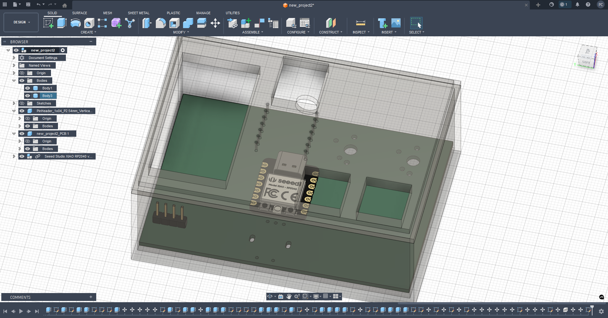
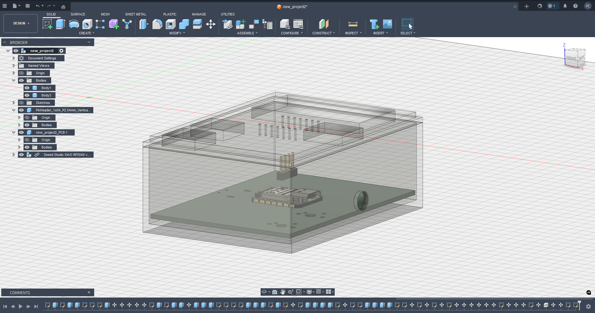
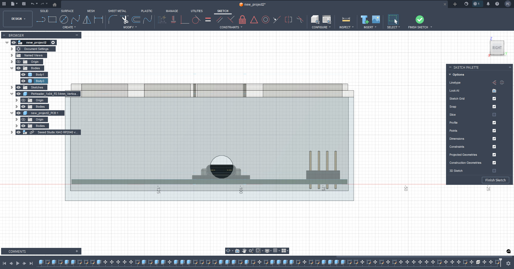

# DIY Marauder

A custom macro keypad based on the Seeed XIAO RP2040. Designed in KiCad and Fusion 360.

## Project Features
* **Microcontroller:** Seeed XIAO RP2040 (USB-C)
* **Display:** 0.91" OLED (I2C)
* **Controls:** 1x EC11 Rotary Encoder + 2x Mechanical MX Switches
* **Case:** Custom 3D printed snap-fit enclosure

## Gallery

### Schematic

### PCB Routing

### 3D PCB Render

### 3D Printed Case

### Assembly Preview
The PCB fits perfectly inside the custom 3D printed case (designed with 0.4mm clearance).

### Assembly Preview Seeed XIAO RP2040

---

## Bill of Materials (BOM)

| Component | Quantity | Description |
| :--- | :---: | :--- |
| **Seeed XIAO RP2040** | 1 | Microcontroller |
| **0.91" OLED Display** | 1 | I2C, SSD1306 driver |
| **EC11 Rotary Encoder** | 1 | With push button |
| **MX Mechanical Switches** | 2 | 3-pin or 5-pin |
| **Keycaps** | 2 | For MX switches |
| **Knob** | 1 | For encoder |
| **3D Printed Case** | 1 | Files in `3D_Models` folder |

---

## Folder Structure
* **Gerbers:** Manufacturing files ready for JLCPCB.
* **KiCad_Source:** Editable project files for KiCad.
* **3D_Models:** STL and STEP files for printing.
